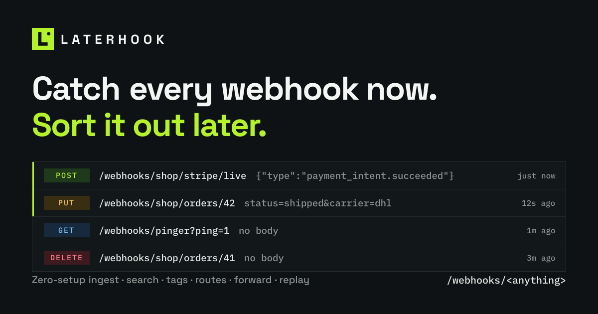
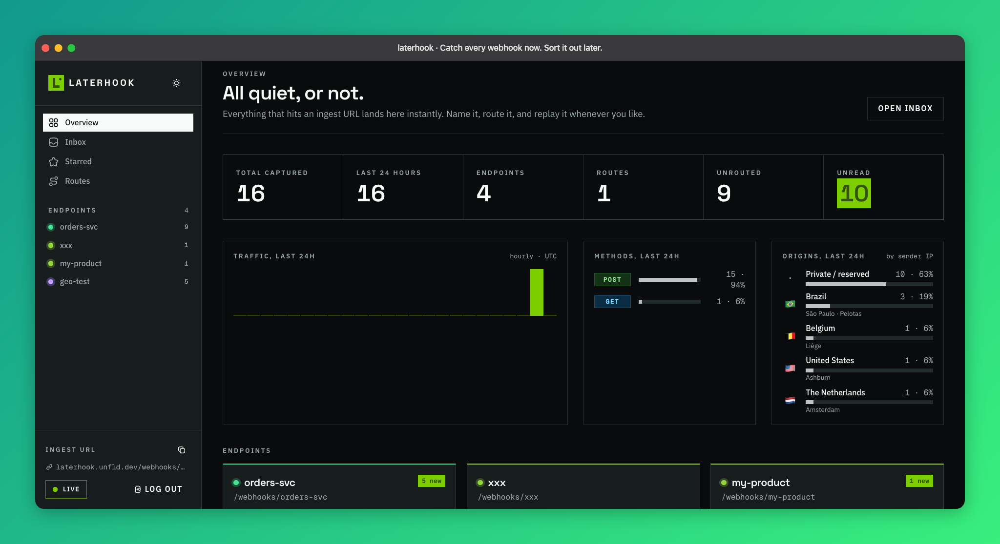
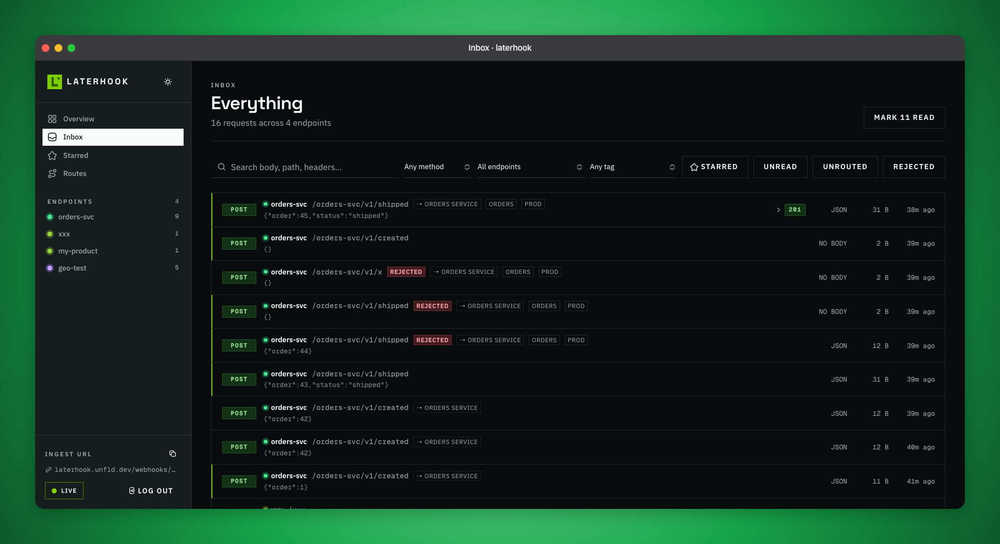
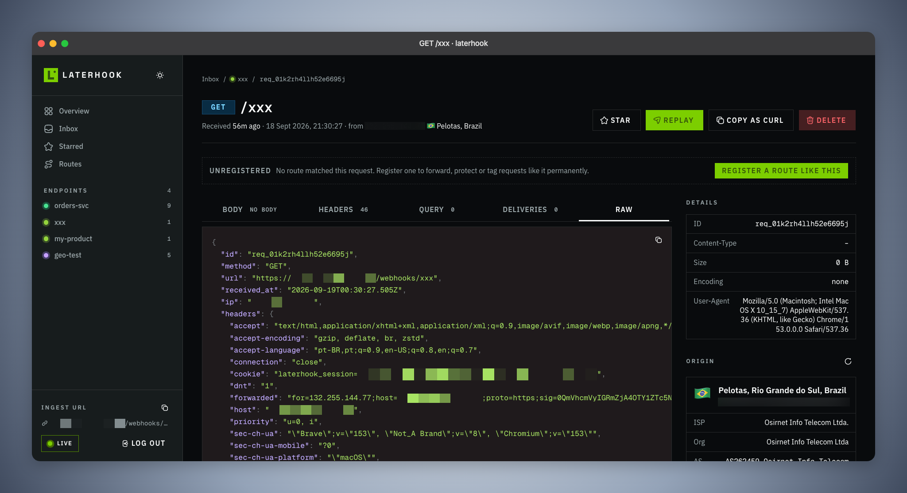
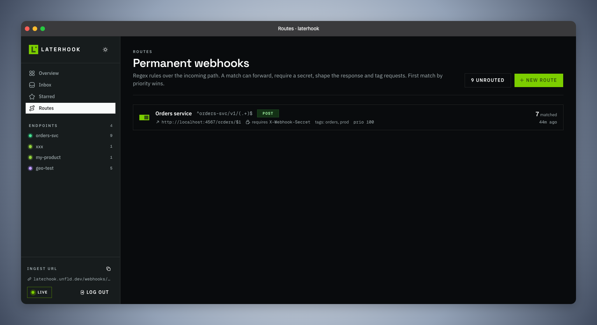
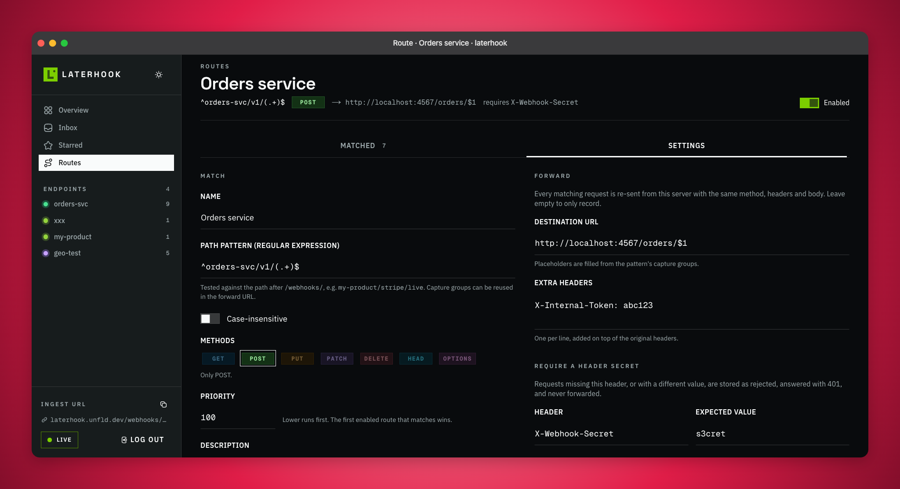
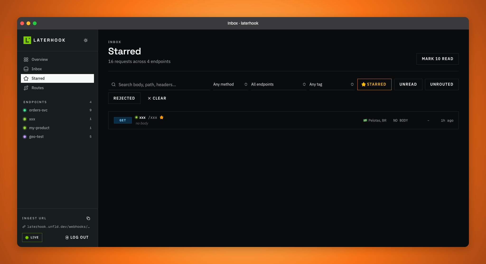
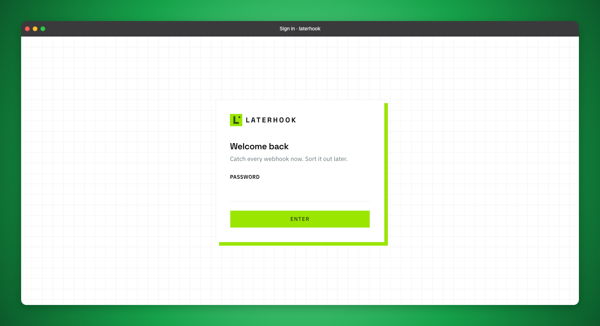
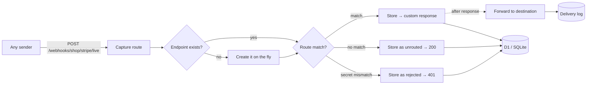

<p align="center">
  
</p>

<h1 align="center">laterhook</h1>

<p align="center">
  <strong>Catch every webhook now. Sort it out later.</strong><br>
  A self-hosted webhook inbox with zero-setup ingest, a dashboard you'll actually enjoy opening,<br>
  and permanent routes that forward, protect and tag traffic once you know what it is.
</p>

<p align="center">
  <a href="#quick-start">Quick start</a> ·
  <a href="#how-it-works">How it works</a> ·
  <a href="#routes-make-it-permanent">Routes</a> ·
  <a href="#configuration">Configuration</a> ·
  <a href="#development">Development</a>
</p>

<p align="center">
  
  
  
  
  
</p>

<br>

<p align="center">
  
</p>

## Why

Every new product needs webhook URLs before it has anywhere to put them. Stripe wants one today, the payment provider tomorrow, GitHub next week. You end up with throwaway request bins, half-configured tunnels, and payloads you wish you had kept.

laterhook flips the order. **Send first, decide later.**

```bash
curl -X POST https://hooks.example.com/webhooks/my-product/stripe \
  -H 'content-type: application/json' \
  -d '{"type":"payment_intent.succeeded","amount":4200}'
```

That's it. No endpoint to create, no schema to think about. The endpoint `my-product` now exists, the full request is stored, and the sender got a `200`. When you're ready, open the dashboard, look at what arrived, and turn it into a permanent route that forwards to your real backend.

## What you get

<table>
  <tr>
    <td width="50%" valign="top">
      
      <p><strong>An inbox, not a log.</strong> Every request with its method, endpoint, sub-path, body preview, size, origin flag and age. Filter by method, endpoint, tag, starred, unread, unrouted or rejected. Full-text search across body, headers, path and IP. Live updates while you watch.</p>
    </td>
    <td width="50%" valign="top">
      
      <p><strong>Everything about one request.</strong> Syntax-highlighted body, headers (platform noise folded away), query string, delivery history, raw JSON and a copy-pasteable <code>curl</code>. Star it, tag it, leave a note, or replay it to any URL.</p>
    </td>
  </tr>
  <tr>
    <td width="50%" valign="top">
      
      <p><strong>Routes are the permanent layer.</strong> A regex over the incoming path, optional method filter, priority. First match wins. Enable and disable without deleting. See how many requests each one caught and when.</p>
    </td>
    <td width="50%" valign="top">
      
      <p><strong>Forward, protect, shape, tag.</strong> Forward with <code>$1</code> capture groups and extra headers. Require a header secret and reject everything else with <code>401</code>. Override the response the sender sees. Auto-tag matches. A live tester shows exactly what a path would do.</p>
    </td>
  </tr>
</table>

<details>
<summary><strong>More screens</strong></summary>
<br>
<p align="center">
  
  
</p>
</details>

### Feature list

- **Zero-setup ingest.** Any method, any depth: `/webhooks/<name>/<any/deeper/path>`. Endpoints are created on first contact.
- **Full capture.** Method, URL, headers, query, body (text or base64, size-capped), source IP, user agent, timestamp.
- **Endpoints.** Name, colour, description, optional endpoint-level forwarding and custom acknowledgement.
- **Routes.** Regex + method matching, forwarding with capture groups and extra headers, header secrets, response overrides, auto-tags, backfill of earlier requests, "Register a route like this" from any unrouted request or endpoint.
- **Replay.** Re-send any stored request to any URL. Every attempt is recorded with status, latency and response body.
- **Origins.** Optional ip-api.com enrichment: flag, city, ISP, ASN, timezone, proxy/VPN and datacenter flags, plus a by-country breakdown on the overview.
- **AI triage.** Optional, via [TypeSafe AI](https://docs.typesafe.ai/introduction)'s Jev on [Vercel AI Gateway](https://vercel.com/ai-gateway/models/jev): every request is labelled with its sender (Stripe, GitHub, Slack…), kind (event, test, handshake, scanner probe), how much attention it needs, and whether it reports a failure or carries personal data. Filter by **Needs action**, **Hide noise** or sender. See the 24h triage breakdown on the overview.
- **Live.** New requests appear with a toast while the dashboard is open.
- **Sharing-ready.** Favicon set, Open Graph and Twitter images, web manifest, theme colours. Marked `noindex`.
- **Single password.** Set it in env, done. No accounts, no OAuth dance.
- **Runs on the free tiers.** Vercel for the app, Cloudflare D1 for storage, local SQLite for development.

## Quick start

### Deploy to Vercel

[](https://vercel.com/new/clone?repository-url=https%3A%2F%2Fgithub.com%2Fpedrogmbh%2Flaterhook&env=LATERHOOK_PASSWORD,LATERHOOK_SECRET,LATERHOOK_D1_ACCOUNT_ID,LATERHOOK_D1_DATABASE_ID,LATERHOOK_D1_TOKEN&envDescription=Dashboard%20password%2C%20cookie%20secret%20and%20Cloudflare%20D1%20credentials&envLink=https%3A%2F%2Fgithub.com%2Fpedrogmbh%2Flaterhook%23configuration&project-name=laterhook&repository-name=laterhook)

1. Create a D1 database: `wrangler d1 create laterhook`, or use the Cloudflare dashboard. Keep the database id.
2. Create a Cloudflare API token with **D1: Edit** on your account. Keep the token and your account id.
3. Click the button, or import the repo in Vercel, and set the variables listed under [Configuration](#configuration).
4. Deploy. The schema is created automatically on the first request.

### Run locally

```bash
bun install
cp .env.example .env.local     # set LATERHOOK_PASSWORD, keep DATABASE_DRIVER=sqlite
bun dev                        # http://localhost:3000
```

Send something and watch it appear:

```bash
curl -X POST http://localhost:3000/webhooks/hello/world -d '{"hi":"there"}'
```

Local data lives in `.data/laterhook.db`, git-ignored, created on first use.

## How it works



- The first path segment after `/webhooks/` is the **endpoint**. Anything deeper is kept as a sub-path.
- **Routes** are tested against the whole path, e.g. `shop/stripe/live`, in priority order.
- Forwarding runs **after the response is sent**, so senders always get a fast acknowledgement.
- Every forward and replay becomes a **delivery** row: status, duration, response headers and body.
- With AI triage on, each request is also judged **after the response**: one Jev call answers five typed questions (a Choice for sender, a Choice for kind, a Score for attention, and yes/no probabilities for failure and personal data) in about half a second. Header secrets are redacted before anything leaves laterhook. The event name (`invoice.paid`, `pull_request.opened`) is read by code, not guessed by the model.

## Routes make it permanent

Open any unrouted request and click **Register a route like this**. The form is pre-filled with an anchored pattern for that exact path and method. Loosen it as needed:

| Goal | Pattern | Destination |
| --- | --- | --- |
| Everything for one product | `^my-product(?:/(.*))?$` | `https://api.my-product.com/hooks/$1` |
| Stripe live and test separately | `^shop/stripe/(live\|test)$` | `https://api.shop.com/stripe/$1` |
| One provider, any product | `^([^/]+)/github(?:/.*)?$` | `https://ci.internal/hooks/$1` |
| Record only, but protected | `^partner-x/.*` | *(empty)* + require `X-Partner-Token` |

Each route can also add headers to the forwarded request, return a custom status and body to the sender, and stamp tags onto matches. Requests that fail the secret are kept as **rejected**, answered with `401`, and never forwarded, so you still see who's knocking.

## Configuration

All variables are documented in [`.env.example`](./.env.example).

| Variable | Required | What it does |
| --- | :---: | --- |
| `LATERHOOK_PASSWORD` | yes | Dashboard password. |
| `LATERHOOK_SECRET` | recommended | Signs the session cookie. Falls back to a password-derived value. |
| `LATERHOOK_D1_ACCOUNT_ID` | prod | Cloudflare account id. `CLOUDFLARE_ACCOUNT_ID` also works. |
| `LATERHOOK_D1_DATABASE_ID` | prod | D1 database id. `CLOUDFLARE_D1_DATABASE_ID` also works. |
| `LATERHOOK_D1_TOKEN` | prod | API token with D1 edit rights. `CLOUDFLARE_API_TOKEN` also works. |
| `DATABASE_DRIVER` | no | `d1` or `sqlite`. Inferred from the variables above when unset. |
| `SQLITE_PATH` | no | Local file for the SQLite driver. Default `.data/laterhook.db`. |
| `IP_API_KEY` | no | [ip-api.com](https://ip-api.com) Pro key. Enables sender geolocation. |
| `IP_API_CACHE_DAYS` | no | Days before a cached IP lookup refreshes. Default 30. |
| `AI_GATEWAY_API_KEY` | no | [Vercel AI Gateway](https://vercel.com/ai-gateway) key. With the next variable, enables AI triage. |
| `TYPESAFE_AI_ENABLED` | no | `true` turns AI triage (TypeSafe Jev) on. Both must be set. |
| `TYPESAFE_AI_MODEL` | no | Gateway model id for triage. Default `typesafe-ai/jev`. |
| `LATERHOOK_PUBLIC_URL` | no | Public origin for URLs in the UI and Open Graph tags. Inferred on Vercel. |
| `LATERHOOK_MAX_BODY_BYTES` | no | Largest stored body. Default 512 KiB, larger bodies are truncated. |
| `LATERHOOK_FORWARD_TIMEOUT_MS` | no | Forward and replay timeout. Default 10 s. |
| `LATERHOOK_SESSION_TTL` | no | Session lifetime in seconds. Default 30 days. |

The `LATERHOOK_D1_*` names take precedence over the generic `CLOUDFLARE_*` ones, so a global Cloudflare token exported by your shell can't shadow the project's.

## Development

```bash
bun dev             # dev server with hot reload
bun run typecheck   # tsc --noEmit
bun run build       # production build
bun run db:migrate  # apply the schema to D1 and verify credentials
```

Built with Next.js 16 (App Router, Node runtime), React 19, Tailwind CSS v4, shadcn/ui v4 on Base UI, Hugeicons, and Cloudflare D1 over its REST API. There is no ORM: one small driver interface, two drivers, all SQL in one file. See [`AGENTS.md`](./AGENTS.md) for the architecture tour.

## Roadmap

- Retention policy and bulk delete
- Export requests as JSON or HAR
- Payload-based route conditions
- Webhook signature verification helpers for common providers

Ideas and pull requests are welcome.
